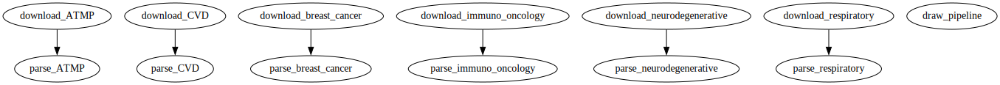

# non-animal-models
The code to experiment with non-animal models extraction

To create environment use micromamba:
```bash
micromamba create -f environment.yaml
micromamba activate non-animal-models
```

## Pull data from DVC
We are using [DVC](http://dvc.org) for data version control.
It is required because database index does not fit into git.
To set it up do:
```bash
dvc pull
```
We use Google Drive to store data, so it may ask you to authorize data access.

# Environment

To run openai API and langchain tracing you need keys in your environment variables.
Do not forget to put on your openai and langchain trace keys.
In .env.template there are environment variables, fill them in with your keys and rename to .env.


# Preprocessing
Our chains use two indexes one for papers and one for database.
Overall you can just pull the data from DVC (it may ask to confirm google drive access)
```bash
micromamba activate non-animal-models
dvc pull
```
However, if you want to update indexes you can use preprocessing scripts at
preprocess.py
After the update you update data of the DVC repo by:
```bash
dvc commit
dvc push
```

Overall, most of the scripts required for preprocessing can be called from dvc, for example:
